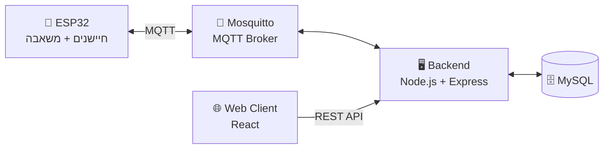

<div align="center">

# 🌱 Smart Irrigation System

מערכת השקיה חכמה מבוססת **ESP32**, עם שרת מלא (**Node.js**), תקשורת **MQTT**,
**REST API** וממשק **WEB** בזמן אמת לניהול ובקרה.

[](#)
[](#)
[-660066?logo=eclipsemosquitto&logoColor=white)](#)
[](#)
[](#)

[](https://irrigation-system.duckdns.org)

</div>

---

## 📋 תוכן עניינים

- [מטרת הפרויקט](#-מטרת-הפרויקט)
- [ארכיטקטורת המערכת](#️-ארכיטקטורת-המערכת)
- [מצבי עבודה](#-מצבי-עבודה)
- [חיסכון במים והגנות](#-חיסכון-במים-והגנות)
- [נתונים וסטטיסטיקות](#-נתונים-וסטטיסטיקות)
- [טכנולוגיות](#-טכנולוגיות)
- [מבנה הפרויקט](#-מבנה-הפרויקט)
- [הפעלת המערכת](#-הפעלת-המערכת)

---

## 🎯 מטרת הפרויקט

מימוש מערכת השקיה חכמה התומכת במספר מצבי עבודה, חיסכון במים,
בקרה בזמן אמת, שמירת נתונים וסטטיסטיקות, בהתאם לדרישות המטלה.

---

## ⚙️ ארכיטקטורת המערכת



| רכיב | תפקיד |
|---|---|
| **ESP32** | קריאת חיישנים, שליטה במשאבה, לוגיקת השקיה |
| **MQTT (Mosquitto)** | תקשורת בזמן אמת בין ה-ESP32 לשרת |
| **Backend (Node.js + Express)** | חשיפת REST API, MQTT Client, גישה לבסיס הנתונים |
| **Database (MySQL)** | שמירת חיישנים, לוג השקיות, צריכת מים |
| **Frontend (React)** | ממשק משתמש לשליטה, סטטוס וסטטיסטיקות |

---

## 🔄 מצבי עבודה

### 🖐 Manual Mode
- שליטה ידנית במשאבה דרך ממשק WEB
- הגנת אור:
  - באור חזק → מופיעה התראה
  - ניתן להפעיל בכפייה (Override)

### 🌡 Temperature Mode (TEMP)
קובע השקיה לפי טמפרטורה:

| תנאי | פעמים ביום | משך כל פעם |
|---|:---:|:---:|
| ימים חמים (≥30°C) | 3 | 3 שעות |
| ימים קרים (<30°C) | 2 | 2 שעות |

- שעות קבועות במהלך היום
- הגנת אור: השקיה רק בצל / לילה / בוקר
- איפוס יומי בחצות

### 🌱 Soil Moisture Mode (SOIL)
- השקיה לפי לחות אדמה:
  - אדמה יבשה → המשאבה נדלקת
  - לחות חזרה לערך הרצוי → המשאבה נכבית
- כולל היסטרזיס למניעת הדלקה/כיבוי תכופים
- הגנת אור מופעלת

### 🕯 Scheduled Mode (SHABBAT)
השקיה מתוזמנת לפי בחירת המשתמש:
- Start Time / End Time
- Times per day
- Duration per irrigation
- אינו תלוי בחיישנים, אינו בודק יום בשבוע (מצב מתוזמן כללי)
- מתאפס אוטומטית בחצות

---

## 💧 חיסכון במים והגנות

- חיישן אור למניעת השקיה בשמש חזקה
- לוג השקיות עם: זמן התחלה, זמן סיום, משך השקיה, צריכת מים (ליטר)
- חישוב צריכת מים לפי קצב זרימה קבוע (L/min)

---

## 📊 נתונים וסטטיסטיקות

- דגימות חיישנים: טמפרטורה, לחות אדמה, עוצמת אור
- שמירה **4 פעמים ביום**: `00:00` · `06:00` · `12:00` · `18:00`
- הצגת גרפים שבועיים בממשק WEB

---

## 🔌 טכנולוגיות

| קטגוריה | טכנולוגיה |
|---|---|
| Hardware | ESP32 (Arduino) |
| Messaging | MQTT (Mosquitto) |
| Backend | Node.js, Express |
| Database | MySQL |
| Frontend | React, React Router |
| HTTP Client | Axios |
| Charts | Chart.js |

---

## 🗂 מבנה הפרויקט

```
irrigation-system/
├── ESP32/irrigaition/     # קוד ה-ESP32 (Arduino)
├── BackEnd/               # Node.js + Express API, MQTT client
├── web-client/            # ממשק React
├── sql/                   # סכמת בסיס הנתונים
└── mosquitto.conf         # הגדרות MQTT Broker
```

---

## 🚀 הפעלת המערכת

### 1. בסיס נתונים
```bash
mysql -u root -p < sql/irrigation_system.sql
```

### 2. שרת Backend (Node.js)
```bash
cd BackEnd
npm install
cp .env.example .env   # ערוך את פרטי החיבור ל-MySQL וה-MQTT
npm start
```

### 3. MQTT Broker
```bash
mosquitto -c mosquitto.conf
```

### 4. ממשק Web (React)
```bash
cd web-client
npm install
npm run dev
```

### 5. ESP32
1. פתח את `ESP32/irrigaition/irrigaition.ino` ב-Arduino IDE
2. ערוך את `config.h` עם כתובת ה-WiFi וה-MQTT שלך
3. העלה ל-ESP32

---

## ✅ סיכום

המערכת מממשת את כל דרישות המטלה:

- ✔️ עבודה בזמן אמת
- ✔️ הפרדה מלאה בין ESP / WEB
- ✔️ חיסכון במים
- ✔️ בקרה, תיעוד וסטטיסטיקות
- ✔️ ממשק משתמש מלא ונוח

<div align="center">

מוגש על ידי **אוסיל חאמד** ו-**דינה נאש**

</div>
